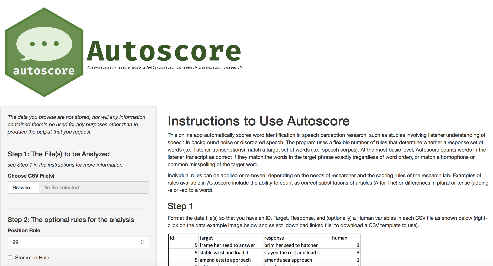

<!-- README.md is generated from README.Rmd. Please edit that file -->
    ## Loading autoscore

    ## ── autoscore 0.3.7 ────────────────────────────────────────────────────────────────────────────────────────────────────────────────────────────────────────────────────────────────────── learn more at tysonbarrett.com ──
    ## ✔ autoscore attached
    ## ✔ No potential conflicts found

[](https://travis-ci.org/TysonStanley/autoscore)


`autoscore` 
===============================================================================================

> R Package: 0.3.7 <br> Shiny App: temporary location at
> <https://tysonstanley.shinyapps.io/autoscore/>

*Authors:*

-   *Tyson S. Barrett*
-   *Sarah E. Yoho*
-   *Stephanie A. Borrie*

The purpose of `autoscore` is to automatically score word identification
in speech perception research, such as studies involving listener
understanding of speech in background noise or disordered speech. The
program uses a flexible number of rules that determine whether a
response set of words (i.e., listener transcriptions) match a target set
of words (i.e., speech corpus). At the most basic level, Autoscore
counts words in the listener transcript as correct if they match the
words in the target phrase exactly (regardless of word order), or match
a homophone or common misspelling of the target word. Individual rules
can be applied or removed, depending on the needs of researcher and the
scoring rules of the research lab. Examples of rules available in
Autoscore include the ability to count as correct substitutions of
articles (A for The) or differences in plural or tense (adding -s or -ed
to a word). Additional rules can be added by the researcher as needed.

The rule options are categorized into either spelling rules or grammar
rules.

#### Spelling Rules

1.  `acceptable_spell_rule`: Response word counted correct if it is a
    homophone or common misspelling of the target word, according to a
    preloaded default acceptable spelling list (contains over 300 common
    acceptable spellings). User can also download the default acceptable
    spelling list, add/remove items, and upload for automation. Response
    word counted correct if is on the acceptable spelling list. Default
    is `FALSE`.
2.  `root_word_rule`: Response word counted correct if the target word
    (e.g. ‘day’) is embedded at either the beginning (e.g. ‘daybreak’)
    of the target word. Default is `FALSE`.
3.  `double_letter_rule`: Response word counted correct if it omitted a
    double letter within a word (e.g. ‘atack’ matches ‘attack’) or added
    an unnecessary double letter (e.g. ‘occassion’ matches ‘occasion’).
    Default is `FALSE`.

#### Grammar Rules

1.  `tense_rule`: Response word counted correct if it differs from the
    target word only by tense; Default is `FALSE`.
2.  `tense_add_rule`: Response word counted correct if it only adds a
    tense as compared to the target word; Default is `FALSE`. It is also
    referred to as “Tense+ Rule.”
3.  `plural_rule`: Response word counted correct if it differs from the
    target word only by plurality; Default is `FALSE`.
4.  `plural_add_rule`: Response word counted correct if it only adds a
    plural as compared to the target word; Default is `FALSE`. It is
    also referred to as “Plural+ Rule.”
5.  `a_the_rule`: Substitutions between “a” and “the” to be scored as
    correct; Default is `FALSE`.

Design
------

The API of the `R` package is simple. A single call to `autoscore()`
with the formatted data will run everything for you. This function is a
composite of several sub-functions that do various jobs:

-   `select_cols()` – The first function which takes the data and gets
    it in the right format for analysis.
-   `split_clean()` – Using the cleaned data from `select_cols()`, this
    uses `stringr` to turn the phrases into individual words.
-   `alternate_fun()` – If a data.frame of alternate spellings is
    provided, this function will find and normalize all alternate
    spellings to match the original spelling as defined by the
    researcher.
-   `match_position_basic()` – This function is the workhorse of the
    package. It takes the cleaned data and does three main things: 1)
    applies all the rules except for the `position_rule`, 2) finds the
    matches between the responses and the targets, and 3) reports how
    far away the matches are from each other.
-   `count_matches()` – Finally, this function takes the information
    from `match_position_basic()` and counts the number of matches based
    on the `position_rule`.

Beyond the main analysis when using `autoscore()`, we can also call
`pwc()` to get the percent words correct (based on the number of target
words) for each observation.

Use of the Online Tool
----------------------

Visit <https://tysonstanley.shinyapps.io/autoscore/> to use the online
tool. Instructions for its use are found there.



Use of the R Package
--------------------

To install the package use the developmental version as it is not yet on
CRAN.

``` r
devtools::install_github("tysonstanley/autoscore_package")
```

An example of the use of `autoscore` is below. We will use the example
data set provided in the package.

``` r
library(tidyverse)
#> ── Attaching packages ───────────────────────────────────────────────────────────────────────────────────────────────────────────────────────────────────────────────────────────────────────────── tidyverse 1.2.1.9000 ──
#> ✔ ggplot2 3.0.0.9000      ✔ purrr   0.2.5      
#> ✔ tibble  1.4.99.9004     ✔ dplyr   0.7.99.9000
#> ✔ tidyr   0.8.1           ✔ stringr 1.3.1      
#> ✔ readr   1.2.0           ✔ forcats 0.3.0
#> ── Conflicts ───────────────────────────────────────────────────────────────────────────────────────────────────────────────────────────────────────────────────────────────────────────────────── tidyverse_conflicts() ──
#> ✖ dplyr::filter() masks stats::filter()
#> ✖ dplyr::lag()    masks stats::lag()
library(autoscore)

data("example_data")
example_data
#> # A tibble: 40 x 4
#>       Id Target                      Response                    human
#>    <dbl> <chr>                       <chr>                       <dbl>
#>  1     1 mate denotes a judgement    made the dinner in it           1
#>  2     1 rampant boasting captain    rubbed against the captain      1
#>  3     1 resting older earring       resting alert hearing           1
#>  4     1 bolder ground from justice  boulder down from dresses       2
#>  5     1 remove and name for stake   remember the name for steak     3
#>  6     1 done with finest handle     dinner finished handle          1
#>  7     1 support with dock and cheer she put the duck in chair       1
#>  8     1 or spent sincere aside      earth bent spent her aside      2
#>  9     1 account for who could knock i can for hookah knock          2
#> 10     1 connect the beer device     connected beard kindle bus      1
#> # … with 30 more rows
```

First, let’s use all the defaults and look at the first 10 rows of the
output.

``` r
example_data %>%
  autoscore() %>%   ## using all the defaults
  as.tibble()       ## to shorted output
#> # A tibble: 40 x 6
#>       id target                response              human autoscore equal
#>    <dbl> <fct>                 <fct>                 <dbl>     <int> <lgl>
#>  1     1 mate denotes a judge… made the dinner in it     1         0 FALSE
#>  2     1 rampant boasting cap… rubbed against the c…     1         1 TRUE 
#>  3     1 resting older earring resting alert hearing     1         1 TRUE 
#>  4     1 bolder ground from j… boulder down from dr…     2         1 FALSE
#>  5     1 remove and name for … remember the name fo…     3         2 FALSE
#>  6     1 done with finest han… dinner finished hand…     1         1 TRUE 
#>  7     1 support with dock an… she put the duck in …     1         0 FALSE
#>  8     1 or spent sincere asi… earth bent spent her…     2         2 TRUE 
#>  9     1 account for who coul… i can for hookah kno…     2         2 TRUE 
#> 10     1 connect the beer dev… connected beard kind…     1         0 FALSE
#> # … with 30 more rows
```

Next, let’s change some of the rules.

``` r
example_data %>%
  autoscore(plural_rule = FALSE, tense_rule = FALSE) %>%
  as.tibble()
#> # A tibble: 40 x 6
#>       id target                response              human autoscore equal
#>    <dbl> <fct>                 <fct>                 <dbl>     <int> <lgl>
#>  1     1 mate denotes a judge… made the dinner in it     1         0 FALSE
#>  2     1 rampant boasting cap… rubbed against the c…     1         1 TRUE 
#>  3     1 resting older earring resting alert hearing     1         1 TRUE 
#>  4     1 bolder ground from j… boulder down from dr…     2         1 FALSE
#>  5     1 remove and name for … remember the name fo…     3         2 FALSE
#>  6     1 done with finest han… dinner finished hand…     1         1 TRUE 
#>  7     1 support with dock an… she put the duck in …     1         0 FALSE
#>  8     1 or spent sincere asi… earth bent spent her…     2         2 TRUE 
#>  9     1 account for who coul… i can for hookah kno…     2         2 TRUE 
#> 10     1 connect the beer dev… connected beard kind…     1         0 FALSE
#> # … with 30 more rows
```

We can also change the output type to “none” to get all the data from
the computation.

``` r
example_data %>%
  autoscore(output = "none")
#> # A tibble: 40 x 10
#>       id target response human diff_target_pre diff_response_p… diff_target
#>    <dbl> <list> <list>   <dbl> <list>          <list>           <list>     
#>  1     1 <chr … <chr [5…     1 <int [4]>       <int [5]>        <lgl [4]>  
#>  2     1 <chr … <chr [4…     1 <int [3]>       <int [4]>        <lgl [3]>  
#>  3     1 <chr … <chr [3…     1 <int [3]>       <int [3]>        <lgl [3]>  
#>  4     1 <chr … <chr [4…     2 <int [4]>       <int [4]>        <lgl [4]>  
#>  5     1 <chr … <chr [5…     3 <int [5]>       <int [5]>        <lgl [5]>  
#>  6     1 <chr … <chr [3…     1 <int [4]>       <int [3]>        <lgl [4]>  
#>  7     1 <chr … <chr [6…     1 <int [5]>       <int [6]>        <lgl [5]>  
#>  8     1 <chr … <chr [5…     2 <int [4]>       <int [5]>        <lgl [4]>  
#>  9     1 <chr … <chr [5…     2 <int [5]>       <int [5]>        <lgl [5]>  
#> 10     1 <chr … <chr [4…     1 <int [4]>       <int [4]>        <lgl [4]>  
#> # … with 30 more rows, and 3 more variables: diff_response <list>,
#> #   count_target <int>, count_response <int>
```

To use the acceptable spelling rule, let’s use the default provided in
`autoscore`. . In the data frame below, the `target` spellings are the
generally accepted spellings that are in the target list of words while
the `acceptable` column are those that should also be counted as
correct.

``` r
autoscore::acceptable_spellings
#> # A tibble: 257 x 2
#>    target   acceptable       
#>    <chr>    <chr>            
#>  1 absent   abcent           
#>  2 achieved achieved, achived
#>  3 acid     asid             
#>  4 advance  advanse          
#>  5 again    agin             
#>  6 alone    aloan            
#>  7 along    a long           
#>  8 among    amung            
#>  9 ancient  ansient          
#> 10 ancient  anceint          
#> # … with 247 more rows
```

Using this, we can provide it to the `autoscore()` function with the
`acceptable_df` argument.

``` r
example_data %>%
  autoscore::autoscore(acceptable_df = autoscore::acceptable_spellings) %>%
  as.tibble()
#> # A tibble: 40 x 6
#>       id target                response              human autoscore equal
#>    <dbl> <fct>                 <fct>                 <dbl>     <int> <lgl>
#>  1     1 mate denotes a judge… made the dinner in it     1         0 FALSE
#>  2     1 rampant boasting cap… rubbed against the c…     1         1 TRUE 
#>  3     1 resting older earring resting alert hearing     1         1 TRUE 
#>  4     1 bolder ground from j… boulder down from dr…     2         2 TRUE 
#>  5     1 remove and name for … remember the name fo…     3         3 TRUE 
#>  6     1 done with finest han… dinner finished hand…     1         1 TRUE 
#>  7     1 support with dock an… she put the duck in …     1         0 FALSE
#>  8     1 or spent sincere asi… earth bent spent her…     2         2 TRUE 
#>  9     1 account for who coul… i can for hookah kno…     2         2 TRUE 
#> 10     1 connect the beer dev… connected beard kind…     1         0 FALSE
#> # … with 30 more rows
```

In each of these examples, it is clear that the human and “autoscore”
agree the majority of the time. The times that they disagree, it is
usually predictably a human error or a subjective judgement that the
researcher will have to consider (for example by including alternate
spellings of words as we just demonstrated).

### Learn More

Peer-reviewed publications and further tutorials are forthcoming. For
more information, contact <autoscorehelp@gmail.com>.
